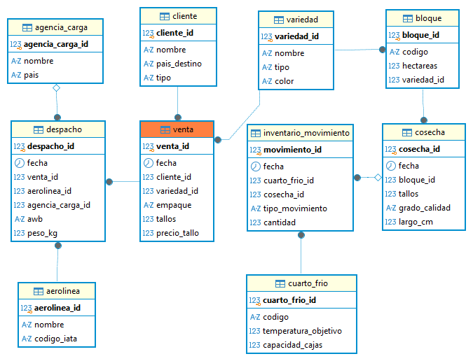

# 🌹 Floricola Analytics

Proyecto de portafolio de punta a punta (SQL, Power BI y forecasting) sobre una florícola exportadora ficticia de Ecuador.

> **Aviso:** todos los datos son **sintéticos**, generados con un simulador en Python. No pertenecen a ninguna empresa real.

## El caso de negocio

Una florícola cultiva rosas y gypsophila y las exporta a importadores y brokers de USA, Europa y Rusia. Su negocio depende de dos picos de demanda: **San Valentín** (semanas 3 a 6) y **Día de la Madre** (semanas 15 a 18).

Enfrenta dos problemas:

- **Estacionalidad extrema:** producir de menos es perder ventas; producir de más genera merma masiva.
- **Perecibilidad:** la flor envejece en el cuarto frío y cada día de inventario cuesta dinero.

## Preguntas que este proyecto responde

- ¿Qué variedades y bloques rinden más?
- ¿Cuánto cuesta la merma y dónde se produce?
- ¿Qué clientes compraron el año pasado y ya no?
- ¿Cuántos tallos conviene producir para las próximas temporadas altas?

## Modelo de datos



`cliente` y `variedad` son **dimensiones**; `venta` y `cosecha` son **tablas de hechos** conectadas por claves foráneas (esquema en estrella).

## Stack

PostgreSQL 16 (Docker) · DBeaver · Python · Power BI · Prophet / XGBoost

## Cómo levantar la base

```bash
docker compose up -d
```

Conexión: `localhost`, puerto `5433`, base/usuario/contraseña `floricola`.

## Estado del proyecto

- [x] Repo y estructura
- [x] PostgreSQL en Docker y esquema inicial
- [ ] Simulador de datos (Python)
- [ ] Limpieza y análisis en SQL
- [ ] Dashboard en Power BI
- [ ] Forecasting de demanda
- [ ] Tests y CI

## Autor

Wladimir · [GitHub](https://github.com/EderCabascango)
